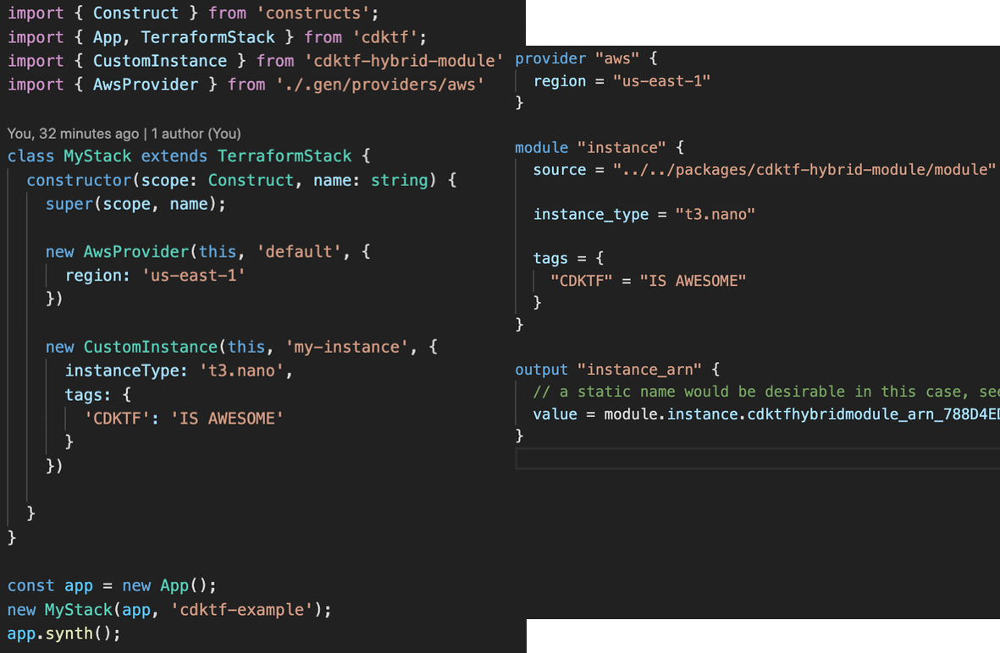

# A Terraform CDK Construct which is usable as Terraform Module as well

This repo demonstratest the usage of a [cdktf](https://cdk.tf) construct package as source for:

- A native Terraform module
- A construct consumable in `cdktf` distributed via NPM
- A native Terraform module distributed via NPM ;)

While this hybrid use-case isn't explictly supported in the Terraform CDK (`cdktf`) at the moment, it's totally possible do achieve this already.

## The general idea

- Synthesize a [stack without a provider](./packages/cdktf-hybrid-module/lib/module.ts) und use the synthesized folder as module.
- Release the [construct](./packages/cdktf-hybrid-module/lib/construct.ts) as part of the npm package
- As bonus, package the Terraform JSON as well, so you could use NPM as module manager

## Examples

- [cdktf construct](./examples/cdktf-example)
- [Terraform module](./examples/terraform)
- [Terraform module npm](./examples/terraform-npm)

## Current Limitations

- Outputs are already fully supported by `cdktf` but due to the random naming a bit hard to use. There' an [open issue](https://github.com/hashicorp/terraform-cdk/issues/247) to address this
- Variables aren't directly supported in `cdktf`, but can still be done with [escape hatches](https://cdkt.tf/escape-hatche). There's an [open issue](https://github.com/hashicorp/terraform-cdk/issues/249)
- Since there aren't official prebuilt provider packages at the moment, this has to inline the generated constructs. That's the biggest drawback at the moment, but the work to improve this is underway - see this [open issue](https://github.com/hashicorp/terraform-cdk/issues/98).

## Next Iteration

- [ ] Add [jsii](https://cdk.tf/jsii) for polyglot package
- [ ] Add unit tests
- [ ] Come up with a more realistic example for the construct

## Conclusion

While it's not the best user experience at this point, I think this demonstrates that the [Terraform CDK](https://cdkt.tf) is capable of distributing hybrid modules. When the various issues around this topic are fixed, it'll be actually a pretty good user experience from my point of view.

## Contributions

Contributions to this repository are more than welcome!