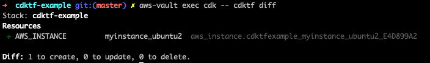

# Use Construct as NPM package in cdktf stack

This demonstrate how to use a custom construct NPM package in a `cdktf` stack.

### A few things to note

- The custom construct should declare `peerDependencies` on `cdktf` and `constructs`
- Until [pre-built providers](https://github.com/hashicorp/terraform-cdk/issues/98) are shipped, the providers constructs have to built and commited in the custom construct and the consuming `cdktf` app

