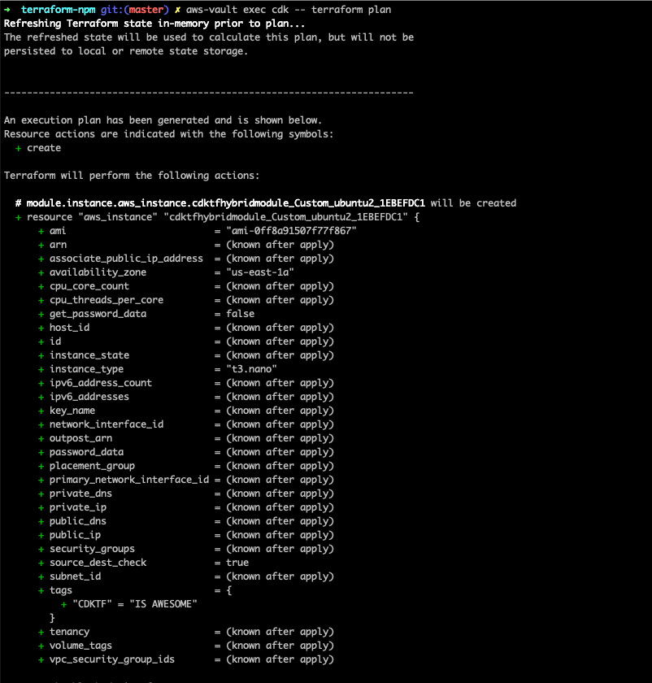

# Use NPM as distribution channel for native Terraform modules

This demonstrate how to use NPM as distribution channel for native Terraform modules. It uses the fact, that you can literally ship anything as NPM package and with `node_modules/<package-name>` there's a predictable inline path to reference.

```hcl
module "instance" {
  source = "./node_modules/cdktf-hybrid-module/module"

  // more ...
}
```

While I wouldn't neccessarily recommend doing this, I don't think it's too far fetched for some some use cases.

