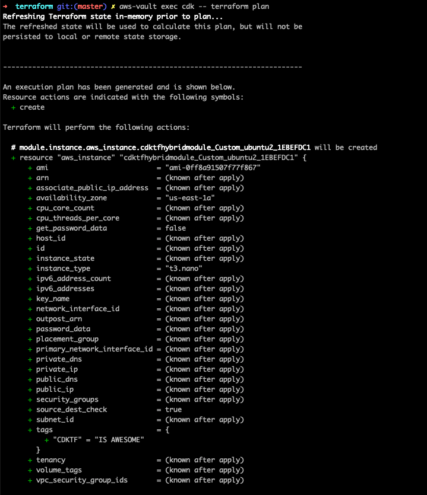

# Native Terraform Module

One can use the `synthesized` output of a `cdktf` stack and [commit it](../../packages/cdktf-hybrid-module/module) to a git repo. From there it can be natively referenced, or perhaps even published to the Terraform registry.

